# Employee Data Analysis

## About the Dataset
This dataset contains detailed information on employees across various departments and countries, capturing key aspects of their employment and performance metrics.

### Dataset Features
- **No**: Unique identifier for each employee.
- **First Name**: The employee's first name.
- **Last Name**: The employee's last name.
- **Gender**: Gender of the employee (Male/Female).
- **Start Date**: The date when the employee started working in the company.
- **Years**: The number of years the employee has been with the company.
- **Department**: The department in which the employee works.
- **Country**: The country where the employee is located.
- **Center**: The center (region or office) where the employee is based.
- **Monthly Salary**: The employee's monthly salary in USD.
- **Annual Salary**: The employee's annual salary in USD.
- **Job Rate**: A performance rating or job rate on a scale (details to be specified if available).
- **Sick Leaves**: The number of sick leaves taken by the employee.
- **Unpaid Leaves**: The number of unpaid leaves taken by the employee.
- **Overtime Hours**: The total number of overtime hours worked by the employee.

---

## Exploratory Data Analysis (EDA)

### **1. Employee Tenure and Retention Analysis**
1. **Which departments have the highest and lowest average tenure?**
   - Environmental Health/Safety Department: **6.3 years** (highest).
   - Research/Development: **4.8 years** (lowest).

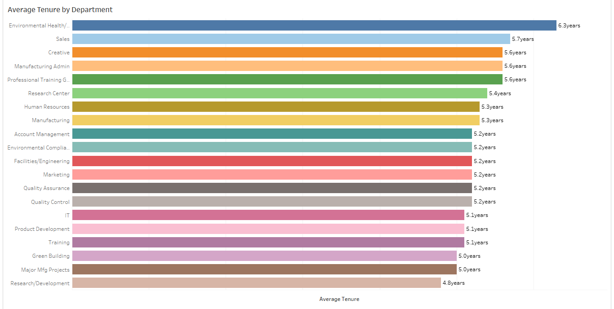

2. **What percentage of employees have been with the company for more than five years?**  
   - **37%** (257 employees) of the total workforce (697) have been with the company for over 5 years.

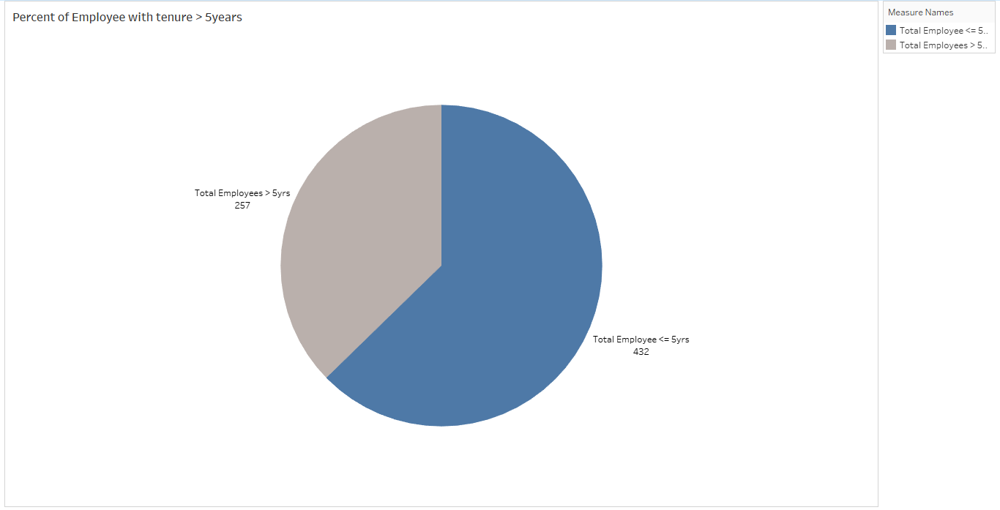

   - **By department**:
     - **Manufacturing**: Highest count with 55 employees (21.4% of total employees with over 5 years tenure).
     - **Research/Development**: Lowest count with 1 employee (0.1%).

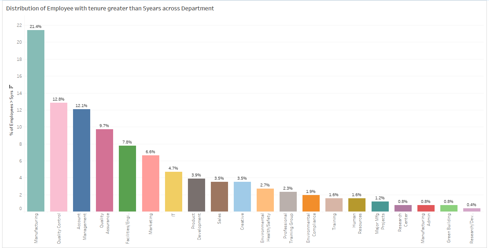

---

### **2. Salary Trends and Comparisons**
3. **What is the average monthly salary by department and country?**
   - **Environmental Compliance**: Highest average monthly salary of **$2.7k**, with Syria leading at **$3.2k**.
   - **Research Center**: Lowest average salary of **$1.8k**, with Saudi Arabia at **$2.8k**.

4. **How does the salary differ by gender across departments or countries?**
   - In most departments (13 out of 20), males earn more than females by **$100–$500** on average.
   - Notable exception: **Environmental Health/Safety**, where females earn **$1.2k** more on average ($2.9k vs. $1.7k).

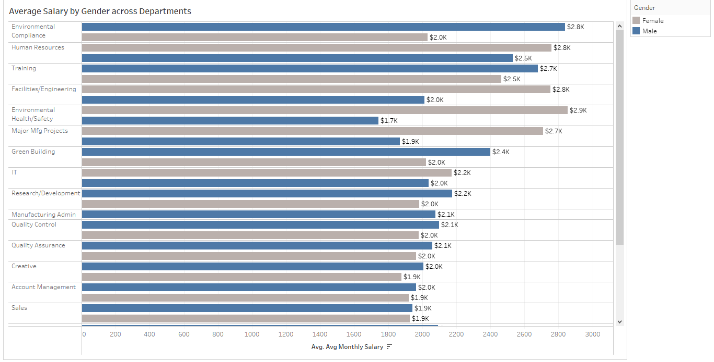

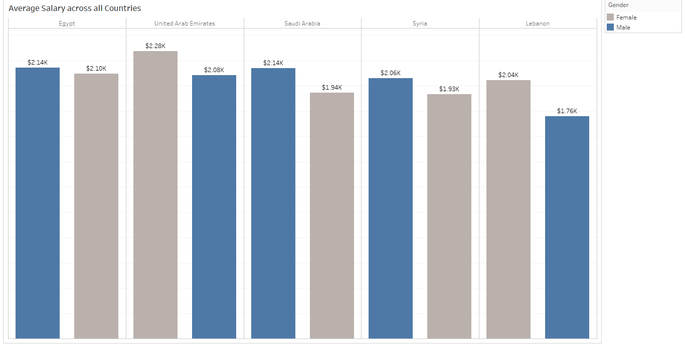

5. **Are there any employees whose monthly salary doesn’t align with their annual salary (suggesting potential data errors)?**
   - No discrepancies found between monthly and annual salary figures.

---

### **3. Leave Analysis and Productivity**
6. **What is the average number of sick and unpaid leaves taken by employees in each department?**
   - **Research Center**: Highest average leaves (6 total: 2 unpaid and 4 sick).
   - **Research Department**: Lowest average leaves (1 sick leave).

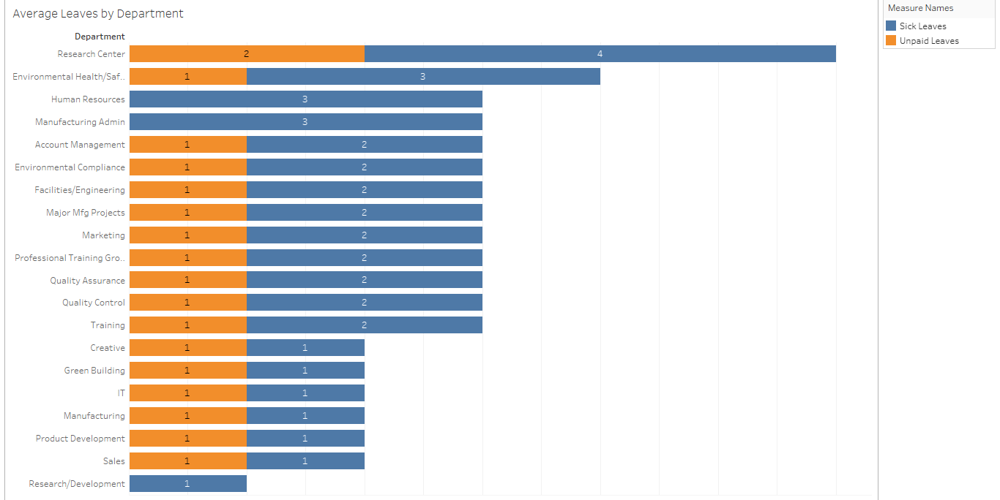

7. **How does the number of leaves taken correlate with the job rate?**
   - No significant patterns. Employees with the highest leave count (12 days) averaged a job rating of **1.0**.

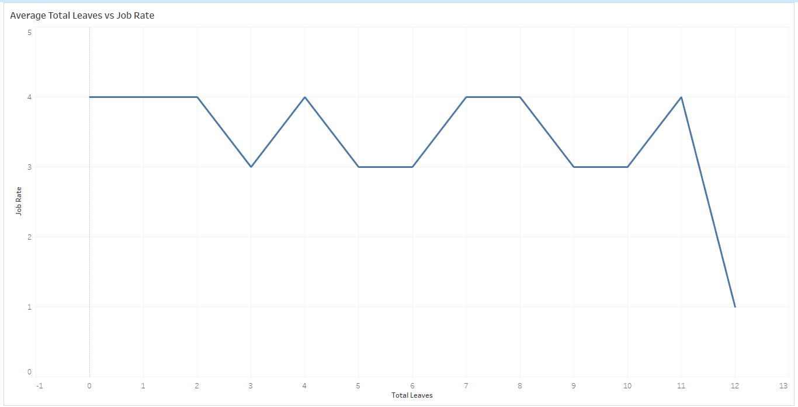

### **4. Overtime and Compensation Balance**
8. **Which employees have the highest number of overtime hours, and how does it relate to their monthly salary?**
   - **Omar Hishan (Quality Control)**: Most overtime hours (198), earning **$3,247/month**.
   - **Ghadir Hmshw (Quality Control)**: 183 overtime hours, earning **$1,560/month**.
   - No consistent correlation observed between overtime hours and salary.

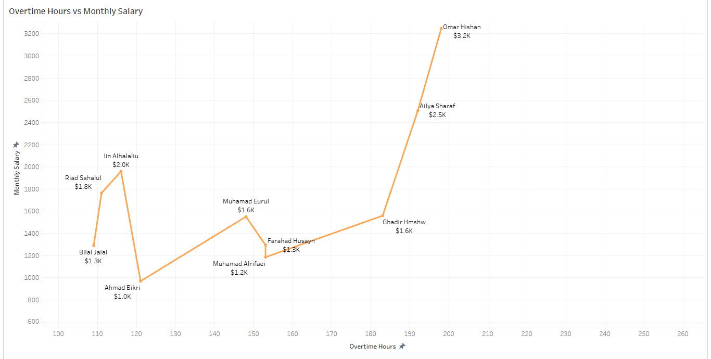

---

### **5. Employee Turnover Prediction Preparation**
9. **Which countries show a high count of employees with below-average job ratings and low tenure?**
   - **Egypt**: Highest count (8 employees).

10. **Which departments show a high count of employees with below-average job ratings and low tenure?**
   - **Manufacturing**: 4 employees.

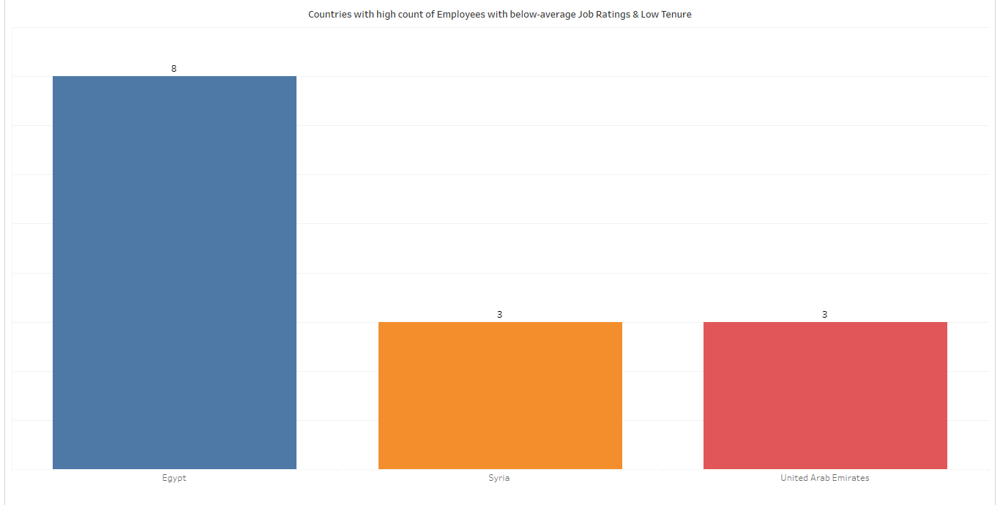

---

### **6. Global Workforce Distribution**
11. **How many employees work in each country and center, and what is the average salary by location?**
   - **Egypt**: Most employees (379), average monthly salary of **$2.1k**.
   - **Lebanon**: Fewest employees (11), average salary of **$1.8k**.
   - **Main Center**: Largest center (251 employees), average salary of **$2.1k**.

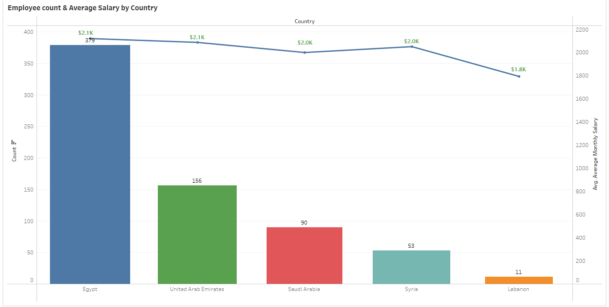

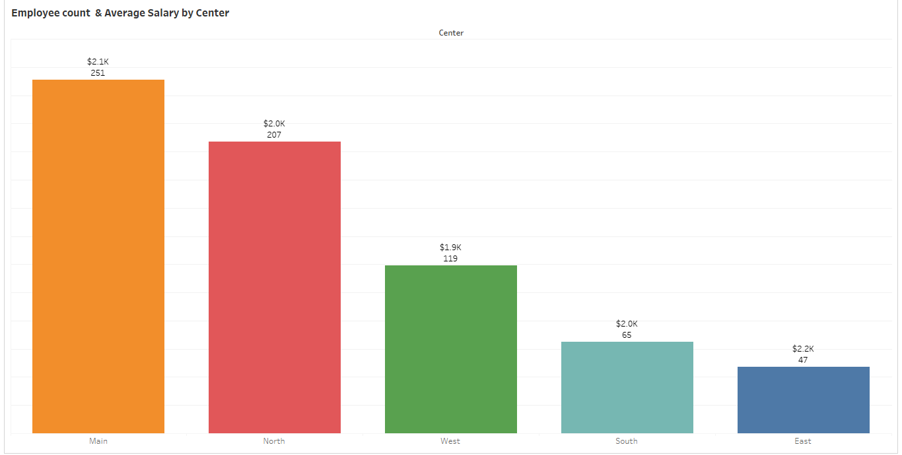

12. **What is the distribution of genders across departments, countries, and centers?**
   - Males constitute the majority across all categories. Gender ratios vary slightly but males consistently outnumber females.

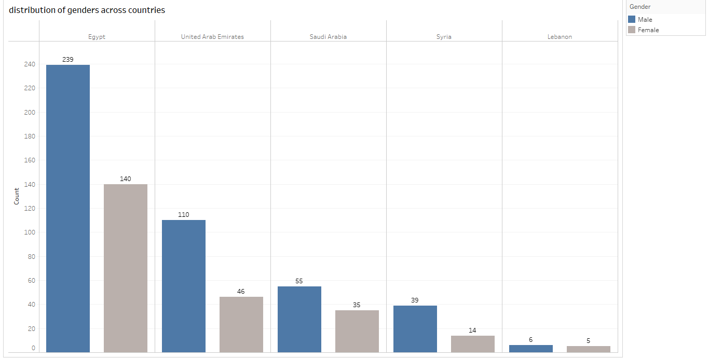

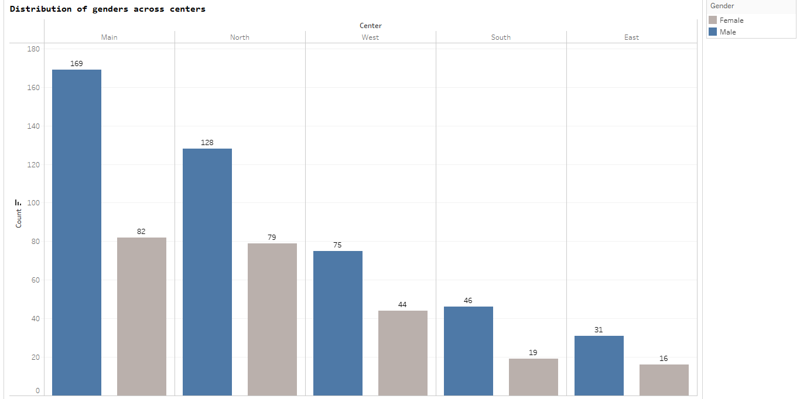

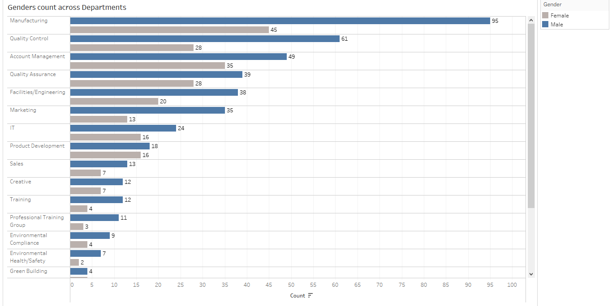

---

### **7. Job Performance Ratings Analysis**
13. **What is the average job rate in each department, and does it vary significantly by countries?**
   - Departments like **Human Resources**, **Major Manufacturing Projects**, and **Research Center** have the highest average job ratings (**5.0**).
   - Countries like **Syria** tend to have higher job ratings across major departments.

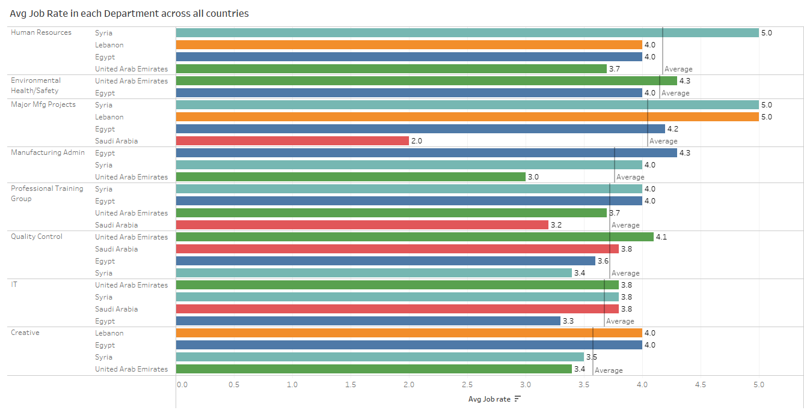

---

## Acknowledgment
- Dataset sourced from [Kaggle](https://www.kaggle.com/datasets/abdallahwagih/company-employees).

---